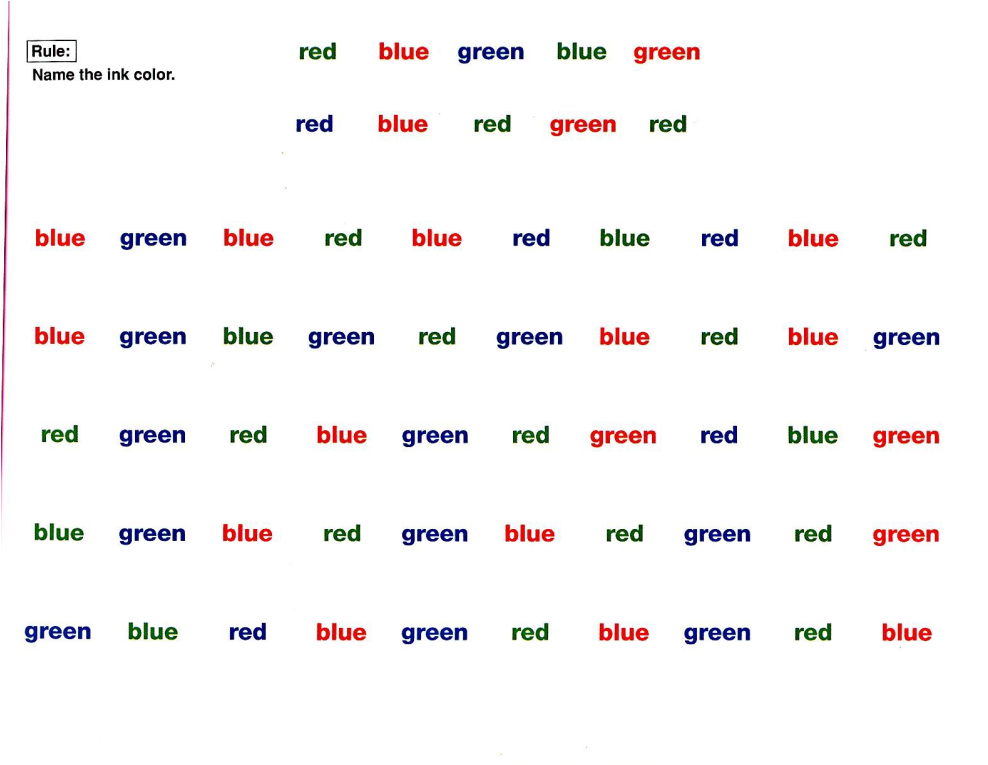

```{r setup, include=FALSE}
## load libraries
library(crosstalk)
library(dplyr)
library(gifski)
library(highcharter)
library(htmlwidgets)
library(knitr)
library(languageserver)
library(manipulateWidget)
library(revealjs)
library(svglite)
library(tibble)
library(vroom)
library(widgetframe)
library(xaringan)
library(xaringanExtra)
library(xaringanthemer)
library(tidyverse)
library(bwu)
library(neuro2)
## knitr options
options(htmltools.dir.version = FALSE)
knitr::opts_chunk$set(
  fig.path = "figs/",
  fig.width = 12,
  fig.height = 4,
  fig.asp = .5,
  fig.retina = 3,
  out.width = "100%",
  fig.showtext = TRUE,
  comment = NULL,
  cache = FALSE,
  cache.path = "cache/",
  echo = FALSE,
  message = FALSE,
  warning = FALSE,
  dev = c("svg", "svglite"),
  hiline = TRUE
)
library(showtext)
library(ggplot2)
font_add_google("Fira Code", "Fira Code")
showtext_auto()

# theme for chalkboard
theme_chalk <- function() {
  theme_minimal() %+replace%
    theme(
      axis.ticks = element_line(colour = "white", size = 0.25),
      text = element_text(colour = "white"),
      axis.text = element_text(
        colour = "white",
        family = "Fira Code",
        size = 18
      ),
      axis.title = element_text(
        colour = "white",
        family = "Fira Code",
        size = 24
      ),
      panel.background = element_rect(colour = NA, fill = "transparent"),
      plot.background = element_rect(colour = "white", fill = "transparent"),
      legend.position = "bottom",
      legend.title = element_blank(),
      panel.grid.minor = element_blank(),
      panel.grid.major.x = element_line(colour = "white", size = 0.25),
      panel.grid.major.y = element_line(colour = "white", size = 0.25),
      legend.text = element_text(size = 24)
    )
}

knitr::opts_chunk$set(dev.args = list(bg = "transparent"))
```

# Reason for Referral

**_From YOU to ME_**

## 1. Diagnostic Clarification in Complex Cases
::: {.incremental}
- Distinguish primary psychiatric disorders from neurocognitive conditions (e.g., ADHD vs. anxiety, depression vs. early neurocognitive disorder)
- Clarify etiology when presentation is atypical or symptoms overlap across diagnostic categories
- Inform treatment selection when standard pharmacotherapy has failed
:::

## 2. Objective Characterization of Cognitive Functioning

- Identify specific cognitive strengths and weaknesses affecting daily functioning
- Quantify deficits in attention, memory, executive function, or processing speed that may maintain or exacerbate psychopathology
- Establish baseline functioning for tracking treatment response or disease progression

## 3. Treatment Planning and Accommodation Recommendations

- Generate data-driven recommendations for academic/workplace accommodations (e.g., MCAT, LSAT, job performance)
- Guide cognitive rehabilitation, compensatory strategy development, and psychoeducation
- Inform capacity evaluations and functional independence assessments

# Standard Neuropsychological Evaluation

## Domains Assessed
```{=html}
<iframe src="img/neuropsych-domains.html" width="1500" height="850" style="border:none; display:block; margin:0 auto;" sandbox="allow-scripts"></iframe>
```

## Neurocognitive Exam

- General Cognitive Ability (e.g., "IQ")
- Academic Skills
- Verbal/Language
- Visual Perception/Construction
- Memory
- Attention/Executive
- Social Cognition
- Adaptive Functioning
- Daily Living Skills

### Commonly Used Tests
- Wechsler Adult Intelligence Scale, 4th ed (WAIS-4)
- Wechsler Individual Achievement Test, 4th ed (WIAT-4)
- Neuropsychological Assessment Battery, Screener (NAB)
- NIH Executive Abilities--Measures and Instruments for Neurobehavioral Evaluation and Research (NIH EXAMINER): Unstructured Task, Verbal Fluency, Behavioral Rating Scale
- California Verbal Learning Test, 3rd ed (CVLT-3)
- Rey-Osterrieth Complex Figure Test (ROCFT)
- Trail Making Test (TMT)
- RBANS
- NEPSY-II

## Behavioral/Emotional/Personality

### ADHD
- Conners' Adult ADHD Diagnostic Interview for DSM-IV (CAADID)
- Conners' Adult ADHD Rating Scales (CAARS)
- Conners' Adult ADHD Rating Scales, 2nd ed (CAARS-2)
- Comprehensive Executive Function Inventory (CEFI)

### Psychopathology/Personality
- Personality Assessment Inventory (PAI)
- Minnesota Multiphasic Personality Inventory (MMPI)

## Effort/Validity Testing

### Symptom Validity Tests (SVTs)
- Structured Inventory of Malingered Symptomatology (SIMS)
- Miller Forensic Assessment of Symptoms Test (M-FAST)
- Test of Memory Malingering (TOMM)

### Performance Validity Tests (PVTs)
- ACS Word Choice Test
- Dot Counting Test (DCT)

### Embedded vs. Standalone Validity Tests
- Embedded: built into the neuropsychological test (e.g., WAIS-4 Digit Span)
- Standalone: separate test designed to assess effort/validity (e.g., DCT)


# Measurement and Objectivity

## How do we measure these domains?



## Distribution of Test Scores: _Population-level Interpretation_

```{r, gauss-plot1, fig.cap = 'Performance classification of neuropsychological test scores in the general population.', fig.retina = 3, fig.asp = 0.5, out.width = '50%'}
knitr::include_graphics("img/plot_narrow.png", auto_pdf = TRUE)
```


## Processing speed and **$$$**


# Case Report - Drilldown Plots

- Patient: 20-something yr-old female

- Referral: ADHD and anxiety for MCAT accommodations

- Relevant History: Multiple mild trauamatic brain injuries (TBIs)/concussions

```{r, read-data2}
library(readr)
neuropsych <- read_csv("data/adhd/neuropsych.csv")
neurocog <-
  readr::read_csv("data/adhd/neurocog.csv", show_col_types = TRUE) |>
  dplyr::filter(scale != "Orientation") |>
  dplyr::filter(narrow != "Response Monitoring") |>
  dplyr::filter(narrow != "Recognition Memory")
neurobehav <-
  readr::read_csv("data/adhd/neurobehav.csv", show_col_types = TRUE)
validity <-
  readr::read_csv("data/adhd/validity.csv", show_col_types = TRUE)
```

## Neurocognitive Examination {background-color="black"}

```{r merge-themes2, echo=FALSE}
# if using single theme
theme <- highcharter::hc_theme_sandsignika()
# if merging themes
theme_merge <-
  highcharter::hc_theme_merge(
    highcharter::hc_theme_monokai(),
    highcharter::hc_theme_darkunica()
  )
```

```{r drilldown-plot1b, fig.width = 12, fig.height = 8, fig.retina = 3, out.width = '100%'}

patient <- "Tupac"
data <- neurocog
neuro_domain <- "Neuropsychological Test Scores"
theme <- theme_merge
plot1b <-
  bwu::drilldown(
    data = data,
    patient = patient,
    neuro_domain = neuro_domain,
    theme = theme
  )
plot1b
```


## Behavioral/Emotional/Personality {background-color="black"}

::: {.notes}
Summary of self- and observer-reports from the PAI, CAARS, and CEFI
:::

```{r drilldown-plot2b, fig.width = 12, fig.height = 8, fig.retina = 3, out.width = '100%'}

data <- neurobehav
neuro_domain <- "Behavioral Rating Scales"
theme <- theme_merge
plot2b <-
  bwu::drilldown(
    data = data,
    patient = patient,
    neuro_domain = neuro_domain,
    theme = theme
  )
plot2b
```

## Effort/Validity Testing {background-color="black"}

```{r drilldown-plot3b, fig.width = 12, fig.height = 8, fig.retina = 3, out.width = '100%'}
data <- validity
neuro_domain <- "Effort/Validity Test Scores"
theme <- theme_merge
plot3b <-
  bwu::drilldown(
    data = data,
    patient = patient,
    neuro_domain = neuro_domain,
    theme = theme
  )
plot3b
```

# Thank you!

- URL to slide deck and resources:
**<https://brainworkup.github.io/PY2-Psychiatry-Residents/>**
